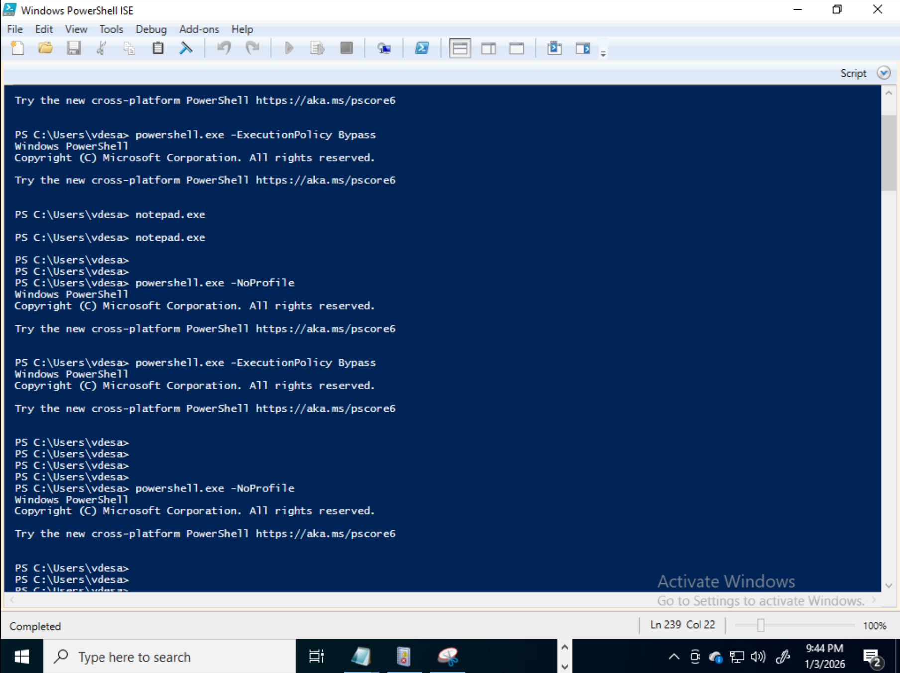
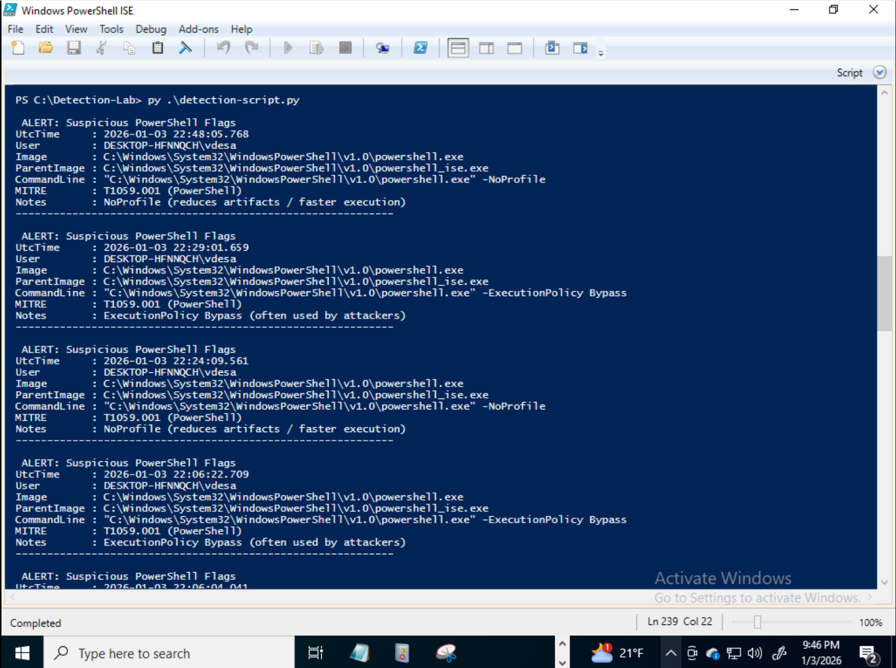

# sysmon-powershell-threat-detection
Detection of suspicious PowerShell execution using Sysmon process creation telemetry, Python-based analysis, and MITRE ATT&amp;CK mapping

## Detection Workflow

### PowerShell Execution (Simulated Attack)

### Detection Output (Python Script)

